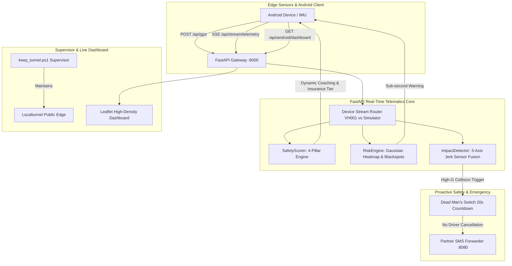

# TECHNEXA 2026 HACKATHON: SMART ROAD SAFETY & INTELLIGENT TELEMATICS PLATFORM
## Comprehensive Project Context, System Architecture & Implementation Log

---

### Executive Summary
This platform is an AI-powered, edge-enabled Intelligent Transportation & Road Safety Telematics ecosystem designed specifically for Indian road dynamics. It bridges physical vehicular IoT/smartphone sensors with high-throughput cloud telematics to deliver:
1. **Edge-Based Crash & Pothole Impact Detection** using 6-axis IMU jerk analysis ($\Delta a / \Delta t$).
2. **Industrial 4-Pillar Driver Safety Index (DSI)** with automated dynamic recovery and Usage-Based Insurance (UBI) premium tiering.
3. **High-Density Multi-Incident Thermal Hazard Heatmap & Blackspot Geofencing** for real-time proactive driver warnings.
4. **20-Second Autonomous Dead Man's Switch** emergency countdown and SMS dispatch gateway.
5. **Mobile-First High-Availability API & SSE Push Stream** for zero-latency native Android Studio integration.

---

## 1. Problem Statement & Judge Defense Framework

### The Hackathon Challenge: Smart Road Safety
* **Domain**: Transportation & Intelligent Mobility
* **Objectives**: Overspeed detection, reckless driving detection, accident & collision mitigation, road defect tracking, automated SOS response, and predictive accident risk scoring.

### Addressing the Judge Critique (Competitive Differentiation)
| Judge Question / Critique | Our Architectural Differentiation & Defense |
| :--- | :--- |
| **"Why use a smartphone/separate IMU? ADAS already does all of this."** | **Democratization of Safety**: 80%+ of road fatalities in India involve two-wheelers, auto-rickshaws, and budget commercial vehicles that **cannot afford ₹1,50,000+ ADAS hardware**. Our solution runs on any standard smartphone or budget ₹300 IoT node, bringing advanced telematics to 200M+ unserved vehicles immediately. |
| **"Google Maps already has traffic and pothole alerts; why use your app?"** | Google Maps relies on **delayed crowdsourced manual taps** and macro traffic averages. Our engine uses **real-time edge IMU high-frequency jerk vectors** to automatically detect and log road hazards without driver distraction, provides sub-second proximity warnings, and calculates an actionable actuarial driver score. |
| **"What is the Revenue Model? Nobody in India buys safety apps."** | **B2B Usage-Based Insurance (UBI)**: Insurers save billions in fraudulent and catastrophic claims by offering dynamic premium cash-backs (up to 25%) to high-scoring drivers. **Commercial Fleet SaaS**: Logistics operators reduce vehicle downtime, brake pad wear, and fuel burn. **Municipal Infrastructure Insights**: Selling road defect thermal density heatmaps to NHAI and smart city corporations for targeted road maintenance. |

---

## 2. System Architecture & Component Breakdown

---

## 3. Core Engine Implementations

### A. 4-Pillar Telematics Safety Scoring Engine (`ml/safety_scorer.py`)
Replaces naive score decrementing with an actuarially sound telematics composite model:
$$\text{Score} = 0.35 \times S_{\text{smooth}} + 0.25 \times S_{\text{corner}} + 0.25 \times S_{\text{speed}} + 0.15 \times S_{\text{vigilance}}$$

* **Pillar 1: Smoothness & Braking ($S_{\text{smooth}}$, 35%)**: Penalizes sudden deceleration shocks ($\ge 4.5\,\text{m/s}^2$) and aggressive jackrabbit acceleration launches.
* **Pillar 2: Cornering & Roll Stability ($S_{\text{corner}}$, 25%)**: Penalizes lateral centrifugal g-force swerves and roll instability ($\ge 3.8\,\text{m/s}^2$).
* **Pillar 3: Speed Compliance ($S_{\text{speed}}$, 25%)**: Computes real-time compliance against local geofenced blackspot speed limits:
  $$\Delta v = v_{\text{vehicle}} - v_{\text{limit}}$$
  Deducts linearly up to 10 points for severe overspeeding ($> 20\,\text{km/h}$).
* **Pillar 4: Hazard Vigilance ($S_{\text{vigilance}}$, 15%)**: Evaluates driver response and speed moderation when approaching high-risk pothole clusters and blind curves.
* **Defensive Driving Recovery**: Drivers naturally recover $+1.25$ points every 15 seconds of clean, compliant driving (capped at 100.0).
* **Actuarial Insurance Tiers**:
  * `90 - 100`: **Platinum Safe** (Eligible for 25% Premium Cash-back)
  * `75 - 89`: **Gold Standard** (Eligible for 15% Premium Discount)
  * `60 - 74`: **Silver Moderate** (Standard Rate)
  * `< 60`: **High Risk** (Premium Surcharge Applied)
* **Real-time Diagnostic Insights**: Detects driver trend (`IMPROVING`, `STABLE`, `DECLINING`) and produces targeted lowest-pillar coaching recommendations.

---

### B. High-Density Gaussian Risk Engine (`ml/risk_engine.py`)
Solves the "invisible heatmap" problem by replacing solitary points with dense Gaussian incident dispersion:
* **Gujarat Incident Mesh (132 points)**: Covers major critical corridors (Iskcon Crossroad, Vaishno Devi Circle, Sarkhej Sanand, Narol Circle, Chhatral Industrial GIDC, Mehsana Bypass).
* **Multi-Format Export for Cross-Platform Interoperability**:
  1. `points`: `[[lat, lon, weight], ...]` for Leaflet Heat web overlays.
  2. `weighted_points`: `[{"lat": ..., "lon": ..., "weight": ...}, ...]` for native Android Google Maps `HeatmapTileProvider`.
  3. `blackspot_zones`: `[{"id", "name", "lat", "lon", "radius_m", "color", "historical_crashes", "fatalities", "speed_limit_kmh"}, ...]` for Android `CircleOptions` and interactive map overlays.
  4. `geojson`: RFC 7946 FeatureCollection for MapLibre / osmdroid.
* **Dynamic Geofenced Speed Limits**: Automatically drops regulatory limit from standard $60\,\text{km/h}$ down to $35-40\,\text{km/h}$ inside active blackspot perimeters.

---

### C. Edge Crash & Impact Detector (`ml/impact_detector.py`)
* **3-Axis Acceleration & Jerk Vector Calculation**:
  $$\vec{J} = \frac{\Delta \vec{a}}{\Delta t} = \frac{\vec{a}_t - \vec{a}_{t-1}}{\Delta t}$$
* **Threshold Triggers**:
  * Pothole bump: Jerk $\ge 12.0\,\text{m/s}^3$
  * Severe Crash: G-force $\ge 3.2\,g$ combined with instantaneous velocity zeroing.
* **Dead Man's Switch (20-Second Window)**:
  * On impact detection, an emergency countdown triggers.
  * If the driver is conscious and taps "I Am Safe", the countdown aborts.
  * If the 20-second timer expires without driver input, an emergency SOS payload with exact GPS coordinates and crash g-force telemetry is autonomously dispatched to the partner SMS gateway (`http://10.32.186.215:8080/send-sms`).

---

### D. Backend Hub & Streaming Layer (`backend/main.py`)
* **Multi-Client Isolation**:
  * Physical Android Device (`device_id="VH001"`) stream is strictly protected and never mixed with synthetic simulator test data.
* **High-Availability Endpoints**:
  * `POST /api/gps`: Core ingest returning enriched DSI score, 4 telematics pillars, speed limit HUD, ahead potholes, and 4 pre-formatted Android UI cards.
  * `GET /api/android/dashboard`: Lightweight, high-availability mobile snapshot designed for direct deserialization into Kotlin RecyclerView or Jetpack Compose.
  * `GET /api/risk/heatmap`: Full thermal dispersion dataset and blackspot zone coordinates.
  * `GET /api/stream/telemetry`: Server-Sent Events (SSE) push stream (`text/event-stream`) providing real-time 1-second ticks.
  * `POST /api/emergency/cancel`: Aborts active Dead Man's Switch.
  * `GET /`: Interactive web dashboard featuring glowing thermal heatmap, physical blackspot danger radius circles, focus zoom controls, and live pillar meters.

---

## 4. Operational Infrastructure & Network Setup

* **Local LAN Address**: `http://10.32.186.140:8000`
* **Public Tunnel**: Managed via persistent background supervisor `keep_tunnel.ps1` with automated 3-second self-healing reconnection.
  * Active Public Endpoint: `https://curvy-frog-93.loca.lt` *(Header: `Bypass-Tunnel-Reminder: true`)*
* **Cross-Platform Console Compatibility**: Implemented UTF-8 reconfiguration and ASCII-safe logging to prevent Windows `charmap` codec crashes during live demo streams.

---

## 5. Android Studio Integration Summary (`clients/ANDROID_INTEGRATION_GUIDE.md`)

* **Kotlin Data Models**: Complete data classes provided for `AndroidDashboardResponse`, `Pillars`, `InsuranceInfo`, and `BlackspotZone`.
* **Google Maps Heatmap**: Ready-to-copy snippet converting `weighted_points` into `WeightedLatLng` for `HeatmapTileProvider`.
* **Danger Geofence Circles**: Kotlin snippet rendering red hazard circles with crash stats on Google Maps.
* **Real-time SSE Listener**: OkHttp `EventSourceListener` implementation for battery-efficient continuous telemetry updates.

---

## 6. Verification & Test Evidence
* **Automated API & Contract Validation**: Passed all endpoints with status `200 OK`.
* **Live IMU Penalty Triggering**: Connected mobile client verified real-time logging of harsh braking ($-6.0\,\text{m/s}^2$), cornering swerves ($5.5\,\text{m/s}^2$), and pothole shocks ($20.3\,\text{m/s}^3$) with dynamic score deductions.
* **Thermal Heatmap Visibility**: Verified Gaussian clustering across 132 coordinates with active auto-fit bounding.
